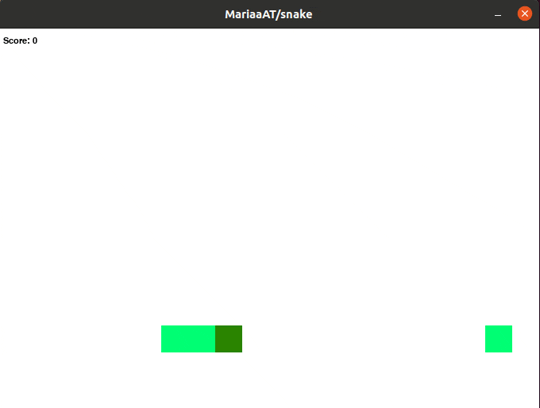

# Snake Game 🐍
## Project's Overview




Who didn't have, back in the 2000s, a Nokia phone and played the famous Snake game? To practice and continue learning Python 
I recreated this famous game. 

Let your memories fly and start playing!

## Installation

This runs in any operating system and can be installed via `pip` directly from GitHub.

```
$ git clone git@github.com:MariaaAT/snake.git
$ cd snake/
$ pip install -r requirements.txt
```

In order to run the game and star playing, run the following:

```
$ python snake/snake.py
```

## Future challenges

*"Perfection is attained by slow degrees; it requires the hand of time."*
                                                                        - *Voltaire*

The following improvements are expected to make:
- [ ] Increase the speed of the snake every time it eats a block.
- [ ] Make the snake appear randomly on the screen.


